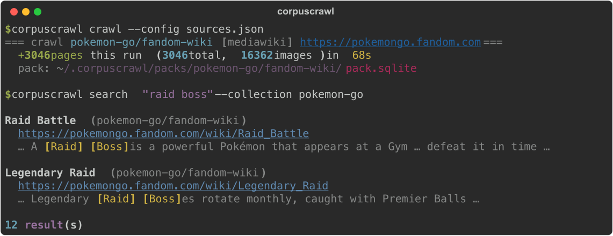

<div align="center">

# 🕸️ corpuscrawl

**Turn any set of web & wiki sources into one offline, full-text-searchable corpus.**

A universal, domain-agnostic reference scraper: point it at a MediaWiki API or a guide site, and it
crawls the content into a resumable SQLite + FTS5 "pack" you can search in milliseconds — offline,
with no re-fetching. Politeness, robots-correctness, and a real-browser fallback for JS/Cloudflare
walls are built in.

[](https://github.com/convenientlymike/corpuscrawl/actions/workflows/ci.yml)
&nbsp;
&nbsp;
&nbsp;
&nbsp;
&nbsp;

<br/>



</div>

## Why

Reference knowledge you rely on lives scattered across wikis and guide sites — fine until you need to
*search across all of it fast*, work offline, or feed it to a tool. Hitting those sites live is slow,
rate-limited, and brittle; ad-hoc scrapers re-fetch everything on every run, choke on JS-rendered or
Cloudflare-gated pages, and quietly ignore `robots.txt` (or over-block on it — Python's stdlib parser
famously false-negatives an explicitly-*allowed* path).

**corpuscrawl** solves all of that once, universally:

- **One command → a searchable local corpus.** `corpuscrawl crawl --config sources.json` builds a
  SQLite + FTS5 pack per source; `corpuscrawl search "raid boss"` returns ranked hits with snippets in
  milliseconds, offline.
- **Domain-agnostic.** A *collection* is any namespace you choose (a project, a topic, a game, a
  product). The engine has zero knowledge of your domain — sources are pure config.
- **Resilient by design.** Resumable (crash / sleep / Ctrl-C → re-run continues), idempotent, polite,
  and it escalates to a **real browser** only when a page is a JS/SPA shell or an anti-bot wall.

## ✨ Features

### 🔌 Pluggable adapters — crawl by *source type*
- **MediaWiki** — structured crawl over the API (`allpages` generator + `allimages`); derives clean
  plaintext + a section outline from wikitext locally (no per-page `extracts` limit). Captures every
  image's **URL + metadata** (no multi-GB binary downloads).
- **Web** — a bounded, same-prefix readable-content crawl with best-in-class extraction
  (`trafilatura` if installed, else a solid `lxml` fallback).
- **Tool** — link-only sources you want tracked but not scraped.

### 🪜 A tiered fetch engine — polite first, forceful only when needed
- **Static** — `httpx` with an honest User-Agent, rate-limit + jitter, exponential backoff on
  `429/503` (honoring `Retry-After`), and **correct** `robots.txt` (a self-contained Google-spec
  matcher: longest-match wins, `Allow` breaks ties, `*`/`$` wildcards — no stdlib false-negatives).
- **Browser** — automatic escalation to a **real Chrome-for-Testing render** (Playwright) when a
  response is a JS/SPA shell or a Cloudflare/anti-bot wall. One reused instance per run.

### 🗄️ A resumable, searchable pack
- **SQLite + FTS5** per source (`<packs-dir>/<collection>/<source>/pack.sqlite`) with BM25 ranking +
  highlighted snippets, WAL + a bounded journal.
- **Resumable + idempotent** — upsert by title, checkpointed continue-tokens; a re-run never
  re-fetches what's already stored.
- **`reprocess`** — re-derive plaintext from stored wikitext when you improve extraction, with **no
  re-crawl**.

### 🧰 A real CLI *and* a clean library API
- `crawl` · `search` · `list` · `info` · `reprocess`, plus a `--url` quickstart with no config file.
- `from corpuscrawl import CorpusPack, TieredFetcher, search_pack, load_config` — compose it into your
  own tools.

## ▶️ Try it

corpuscrawl is a CLI + Python library, so the fastest way to try it is to run it — no browser demo,
no sign-up. Install, then build and search a corpus in three lines:

```bash
pip install corpuscrawl
corpuscrawl crawl --url https://pokemongo.fandom.com --type mediawiki --collection demo --max-pages 50
corpuscrawl search "shiny odds" --collection demo
```

> A hosted playground (StackBlitz / GitHub Pages) is **N/A** here — corpuscrawl runs against real
> network sources and writes local packs, which a sandboxed browser can't do. Running it locally *is*
> the demo.

## 🚀 Quickstart

```bash
pip install corpuscrawl                 # core (MediaWiki + static web)
pip install "corpuscrawl[all]"          # + browser fallback, trafilatura, YAML configs

# quickstart — no config file: crawl one wiki, then search it
corpuscrawl crawl --url https://pokemongo.fandom.com --type mediawiki --collection pokemon-go
corpuscrawl search "raid boss" --collection pokemon-go
```

The browser-escalation tier uses a Chrome-for-Testing binary if one is present (from a prior
`playwright install chromium`); without it, corpuscrawl still crawls everything reachable over static
HTTP and just skips the escalation.

### Config-driven (recommended)

```jsonc
// sources.json
{
  "collection": "pokemon-go",
  "sources": [
    { "id": "fandom-wiki", "name": "Fandom Wiki", "type": "mediawiki",
      "url": "https://pokemongo.fandom.com", "scrape": true },
    { "id": "guides", "name": "Guides", "type": "web",
      "url": "https://example.com/guides", "scrape": true },
    { "id": "toolsite", "name": "A Tool", "type": "tool", "url": "https://tool.example" }
  ]
}
```

```bash
corpuscrawl crawl --config sources.json          # crawl every scrapeable source
corpuscrawl list  --collection pokemon-go        # sources + page/image counts
corpuscrawl info  --collection pokemon-go --source fandom-wiki   # provenance
corpuscrawl search "shiny odds" --collection pokemon-go
```

## 📸 A look inside

Building a corpus from a wiki (2,845 articles + 16,362 image URLs in ~70s), then searching it offline:

```console
$ corpuscrawl crawl --config sources.json
=== crawl pokemon-go/fandom-wiki [mediawiki] https://pokemongo.fandom.com ===
  +3046 pages this run (3046 total, 16362 images) in 68s
  pack: ~/.corpuscrawl/packs/pokemon-go/fandom-wiki/pack.sqlite

$ corpuscrawl search "raid boss" --collection pokemon-go
Raid Battle  (pokemon-go/fandom-wiki)
  https://pokemongo.fandom.com/wiki/Raid_Battle
  … A [Raid] [Boss] is a powerful Pokémon that appears at a Gym … defeat it within the time limit …

Legendary Raid  (pokemon-go/fandom-wiki)
  https://pokemongo.fandom.com/wiki/Legendary_Raid
  … Legendary [Raid] [Boss]es rotate monthly and can be caught with Premier Balls …

12 result(s)
```

## 🏗 Architecture

```
                       corpuscrawl crawl --config sources.json
                                     │
                    ┌────────────────┴─────────────────┐
                    │        config.py (load)          │  domain-agnostic source specs
                    └────────────────┬─────────────────┘
                                     │  [{id,name,type,url,scrape}]
                    ┌────────────────▼─────────────────┐
        adapters.py │  adapter_for(type)               │
                    │   ├─ MediaWikiAdapter  (API)      │
                    │   └─ WebAdapter        (readable) │
                    └───────┬───────────────────┬───────┘
                            │                   │
              core.py  ┌────▼────┐        ┌─────▼──────┐  store.py
        TieredFetcher  │ static  │  wall? │  browser   │   CorpusPack
        (httpx, polite,│ httpx   ├───────▶│ Playwright │   SQLite + FTS5
         robots, retry)└────┬────┘  yes   │ (CfT)      │   resumable, WAL
                            │             └─────┬──────┘
                            └──────── HTML/JSON ─┘
                                     │
                    ┌────────────────▼─────────────────┐
                    │  <packs-dir>/<collection>/<src>/  │
                    │  pack.sqlite  (pages + FTS + imgs)│──▶ corpuscrawl search / library API
                    └───────────────────────────────────┘
```

## 📂 Project layout

```
corpuscrawl/
  core.py       tiered fetch (static → browser) + politeness + robots + extraction
  store.py      SQLite + FTS5 pack (resumable, idempotent)
  adapters.py   MediaWiki + Web adapters, wikitext→plaintext, reprocess
  config.py     load a generic sources config (JSON/YAML) — the only "what to crawl" input
  search.py     BM25 full-text search + page fetch (reusable)
  cli.py        crawl / search / list / info / reprocess
tests/          forcing-function unit tests (no network)
examples/       sources.example.json
```

## 🔒 Security & etiquette

- **Polite by default** — rate-limit + jitter, honest identifiable User-Agent, backoff on `429/503`.
- **robots-correct** — a Google-spec matcher; set `CORPUSCRAWL_IGNORE_ROBOTS=1` only when you own the
  source.
- **Public content only** — the browser tier renders *public* pages to defeat JS/anti-bot gating; it
  is not a login/paywall bypass.
- No secrets, no telemetry, no network egress beyond the sources you configure.

## 📄 License

MIT — see [LICENSE](LICENSE).
